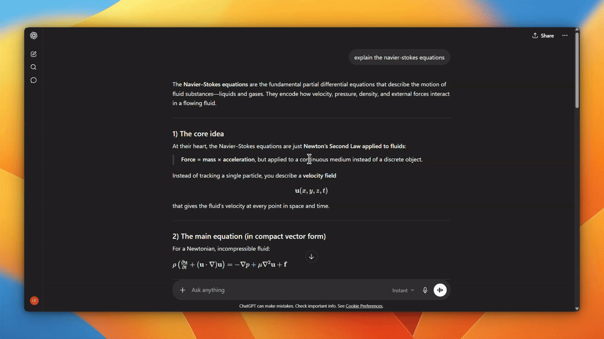

[](https://mseep.ai/app/egroup-labs-kept)

# Kept

<p align="center">
  
</p>

Kept saves your AI conversations as local Markdown files, then gives you a desktop app to search, browse, connect, and reuse them.

It works with ChatGPT, Claude, Gemini, Grok, and Kimi. Your archive lives on your machine under `~/.kept/`, with an Obsidian-compatible vault plus local indexes for full-text search, topics, projects, and graph views.

[Quick Install](#quick-install) | [Download](#download) | [Setup](#setup) | [Build from source](#build-from-source) | [MCP server](#mcp-server)

## Why Kept

AI chats often become working memory: debugging trails, research notes, product decisions, prompts, snippets, and half-finished ideas. Most of that history stays inside vendor UIs.

Kept turns it into files you own.

- Plain Markdown, grouped by provider.
- Fast local search with SQLite FTS5.
- Graph and topic views for finding connections across old conversations.
- Optional chat over your own archive using the model provider you configure.
- An MCP server so coding agents can read, search, and manage the vault.

## How It Works

```
Chromium browser extension
  -> reads conversations from provider API endpoints using your signed-in session
  -> normalizes messages and supported image assets
  -> sends them to the Kept desktop app on http://localhost:18241

Kept desktop app
  -> writes Markdown files to ~/.kept/vault/
  -> indexes content in SQLite
  -> builds a local knowledge graph in CozoDB
  -> exposes search, graph, project, export, and agent tools

MCP server
  -> lets Claude Code, OpenClaw, and other MCP clients work with the vault
```

Kept does not scrape rendered chat pages. The extension syncs conversation data from provider API responses and hands the normalized payload to the local app.

## Supported Providers

| Provider | Sync | Notes |
| --- | --- | --- |
| ChatGPT | Yes | Full conversations, streaming history, branch-aware saves |
| Claude | Yes | Full conversations and streaming history |
| Gemini | Yes | Best effort; Google's API format changes often |
| Grok | Yes | Includes supported image assets |
| Kimi | Yes | Uses the Kimi auth helper included in the extension |

Provider APIs are private and can change without notice. Kept keeps the archive as plain files so your saved conversations stay readable even if an adapter needs an update.

## Quick Install

Windows PowerShell:

```powershell
irm https://kept.work/install.ps1 | iex
```

macOS and Linux:

```bash
curl -fsSL https://kept.work/install.sh | bash
```

The installer downloads the latest GitHub Release, installs the desktop app, and extracts the Chromium extension to a local folder. Browsers still require you to load the extension manually in Developer Mode.

The same scripts can be run directly from GitHub:

```powershell
irm https://raw.githubusercontent.com/egroup-labs/kept.work/main/scripts/install.ps1 | iex
```

```bash
curl -fsSL https://raw.githubusercontent.com/egroup-labs/kept.work/main/scripts/install.sh | bash
```

## Download

Desktop builds are published on [GitHub Releases](https://github.com/egroup-labs/kept.work/releases/latest).

Current release targets:

- macOS Apple Silicon: `.dmg`
- Windows x64: NSIS `.exe` installer
- Linux x64: `.deb` and `.AppImage`

The release also includes the Chromium extension package. Until the Web Store listing is live, install the extension in developer mode.

## Setup

### 1. Install The Desktop App

Use the [Quick Install](#quick-install) command above, or download the build for your OS from [Releases](https://github.com/egroup-labs/kept.work/releases/latest), install it, and launch Kept.

On first launch, Kept creates:

```
~/.kept/
  vault/
  index.db
  kg.db/
  config.toml
  token
```

The app also starts a local server on `http://localhost:18241`. The browser extension uses this local server to send conversations into the vault.

### 2. Load The Browser Extension

Kept supports Chromium-based browsers: Chrome, Brave, Edge, Vivaldi, Arc, Opera, and Chromium.

1. Extract the extension from the release, or use `extension/` from this repo.
2. Open your browser's extensions page, for example `chrome://extensions`.
3. Enable Developer Mode.
4. Click Load unpacked.
5. Select the `extension/` directory.

### 3. Connect The Extension

With the Kept app running, open this page in the same browser:

```
http://localhost:18241/connect
```

That page gives the extension its per-install token. After that, use the extension popup or Kept onboarding flow to sync your providers.

## Vault Layout

Kept writes conversations as Markdown with YAML frontmatter:

```
~/.kept/vault/
  chatgpt/
    2026-05-02_optimizing-cuda-kernel.md
  claude/
    2026-05-02_kept-readme-draft.md
  gemini/
  grok/
  kimi/
```

You can open `~/.kept/vault/` directly in Obsidian, VS Code, or any editor. The files are the source of truth; the search and graph databases can be rebuilt from them.

## MCP Server

`mcp/` is an MCP server named `kept-vault-server`. It lets agentic clients list, read, write, search, rename, and delete files in your Kept vault.

Inside Claude Code:

```text
/plugin marketplace add egroup-labs/kept.work
/plugin install kept-vault@kept-plugins
```

One-line installer for Linux and macOS:

```bash
bash <(curl -fsSL https://raw.githubusercontent.com/egroup-labs/kept.work/main/scripts/install-kept-mcp.sh)
```

PowerShell:

```powershell
& ([scriptblock]::Create((irm https://raw.githubusercontent.com/egroup-labs/kept.work/main/scripts/install-kept-mcp.ps1)))
```

Set `KEPT_VAULT_PATH` if your vault is not at `~/.kept/vault`.

Tools exposed by the server:

- `list_vault`
- `list_directory`
- `read_file`
- `write_file`
- `update_file`
- `delete_file`
- `move_file`
- `grep_vault`

## Build From Source

Requirements:

- Node.js 20+
- Rust toolchain
- A Chromium-based browser
- Optional: [Ollama](https://ollama.com/) for local models and embeddings

```bash
git clone https://github.com/egroup-labs/kept.git
cd kept/app
npm ci
npm run tauri dev
```

### Linux Dependencies

Ubuntu/Debian:

```bash
sudo apt install -y \
  build-essential clang libclang-dev pkg-config \
  libgtk-3-dev libwebkit2gtk-4.1-dev libsoup-3.0-dev \
  libpango1.0-dev libcairo2-dev libgdk-pixbuf-2.0-dev libglib2.0-dev
```

`build-essential`, `clang`, and `libclang-dev` are required for Rust crates that
use `bindgen` (e.g. `zstd-sys` pulled in by CozoDB). The rest are the GTK /
WebKitGTK / GLib stack Tauri 2 links against.

Then run:

```bash
npm run tauri:dev:linux
```

### Frontend-Only Mode

You can run the UI against mock data without the Rust app:

```bash
cd app
npm ci
npm run dev
```

Vite serves the UI at `http://localhost:1420`.

## Repository Layout

```
app/                Tauri 2 desktop app
  src/              React frontend
  src-tauri/        Rust backend, Axum server, vault, search, graph, agent tools
extension/          Chromium extension
  platforms/        Provider sync adapters
mcp/                MCP server for the vault
scripts/            App and MCP install scripts
```

## Privacy And Security

- Core archive and search data stays on your machine in `~/.kept/`.
- The extension talks to the desktop app over `localhost` and must include the bearer token stored at `~/.kept/token`.
- Kept has no hosted account and no cloud sync.
- Optional chat, topic discovery, and graph features call only the model provider you configure, or your local Ollama server.
- The updater checks the configured Kept update endpoint for new desktop releases.

## Contributing

Issues and pull requests are welcome. Conventional commits are preferred:

```text
feat(scope): add ...
fix(scope): repair ...
```

Useful areas to start:

- `extension/platforms/` for provider adapters
- `app/src-tauri/src/vault.rs` for vault writes
- `app/src-tauri/src/db.rs` for search indexing
- `app/src-tauri/src/kg-gen/` for graph generation
- `mcp/src/` for MCP vault tools

## License

MIT
